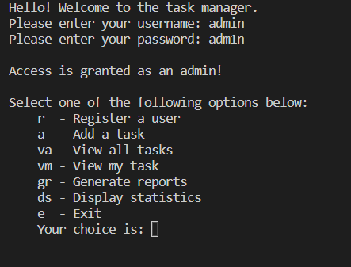

# Task manager

Task manager is a Python program for a small business that can help it to manage tasks assigned to each member of the team. that was made for dealing with inventory management. Managers can use this program to search the product by its code, determine the product with the lowest quantity and restock it, determine the product with the highest quantity, calculate the total value of each stock item.

## Installation <a name="installation"/>

There are two ways to install and run this program on your computer

### 1. Using Docker image

- Download and install [Docker](https://www.docker.com/products/docker-desktop/). You may need to update your Linux as well, when the demand prompted.

- To confirm if you successfully install Docker, run this command in your CP:

```bash
docker run hello-world
```

- With the Docker app opened, run this code in your CP:

```bash
docker run -it andrewthien/my-python-app2
```

- When finished, you should can start using the program by enter corract login details

### 2. Clone the program and try it on Visual Studio Code

Install [Visual Studio Code](https://code.visualstudio.com/) and [Python](https://www.python.org/downloads/), then clone the repository to start using or editing the program.

```bash
git clone https://github.com/AndrewThien/Task-manager.git
```

## Table of Contents
### 1. [Installation](#installation)
### 2. [Usage](#usage)
### 3. [Contributing](#contributing)
### 4. [Credits](#credits)


## Usage <a name="usage"/>

This program will work with two text files, user.txt and tasks.txt. 
 - tasks.txt stores a list of all the tasks that the team is working on.
 - user.txt stores the username and password for each user that has permission to use the program

Login:
- The user will be prompted to enter a username and password. A list of valid usernames and passwords are stored in a text file called user.txt. An appropriate error message will be displayed if the user enters a username that is not listed in user.txt or enters a valid username but not a valid password. The user will repeatedly be asked to enter a valid username and password until they provide appropriate credentials. After login, admin will have more functional menu than normal users.

Funcitons: There are many functions in this program.
- Register new user which is not already existed yet in the system
- Add a new task 
- View all task listed in tasks.txt in a very nice and clean display
- View the task of the user. User can also edit the task, update the task if it is not done yet
- Admin can generate reports about useful and statistical information about users and tasks. A task-overview.txt and user-overview.txt will be auto-generated when admin chooses this function.
- Many nice other functions to be explored



## Contributing <a name="contributing"/>

Pull requests are welcome. For major changes, please open an issue first to discuss what you would like to change.

## Credits <a name="credits"/>

[Tri Thien Nguyen](https://www.linkedin.com/in/tri-thien-nguyen/)
